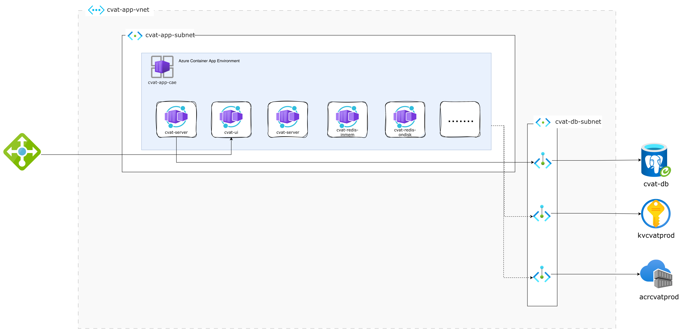

# CVAT in Cloud

## Introduction
Hi, this is my personal project to practice deploy application to cloud environment. Also, if this project can help you at any espect, please let me know, I will be so happy of that. But now it is not done!

Contact me via: +84 987305013 (whatsapp) or tpneik@gmail.com

CVAT - an interactive video and image annotation tool for computer vision. It is used by tens of thousands of users and companies around the world. Our mission is to help developers, companies, and organizations around the world to solve real problems using the Data-centric AI approach.

This infrastucture will be deployed in Azure, leveraging as much as possile Azure Service, mainly on Azure Container App. The architect will be security-enhanced time to time.




## Storage account testing
```bash
echo "hehe" > data.txt
export AZCOPY_SPA_CLIENT_SECRET='your-key'
curl -sL https://aka.ms/downloadazcopy-v10-linux | tar xz --strip-components=1 -C /tmp && sudo mv /tmp/azcopy /usr/local/bin/ && sudo chmod +x /usr/local bin/azcopy
azcopy login --service-principal --application-id 12954a9c-ce35-4d4f-aea5-74830842338e --tenant-id 5e3146a5-cd04-4899-b34c-bd21b10c91e3
ls
cat data.txt 
azcopy copy data.txt "https://mmccvatsa.file.core.windows.net/cvat-cache-db/data.txt"

azcopy copy vector.toml "https://mmccvatsa.file.core.windows.net/cvat-vector-component/vector.toml"

```

## PostgreSQL Testing

```bash
sudo apt-get update && sudo apt-get install -y postgresql-client

export PGHOST=10.28.16.8
export PGUSER=cvatAdmin
export PGPORT=5432
export PGDATABASE=postgres
export PGPASSWORD='H@Sh1CoR3!'

psql
```

## Backend server testing

```bash
curl cvat-server:8080
```

## Use when want to recreate specific resource 

```hcl
terraform apply -replace='module.traefik_vm.azurerm_linux_virtual_machine.this[0]'
```

## Check rule set of storage account

```hcl
az storage account show --name mmccvatsa --resource-group mmc-cvat-rg --query networkRuleSet
```