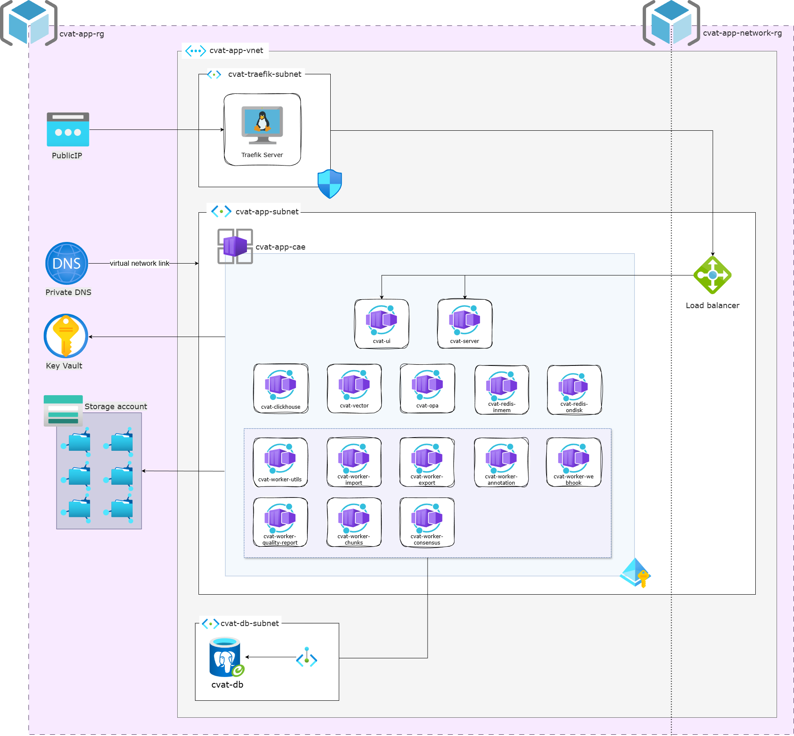

# CVAT in Cloud

[]()

## Table of Contents

- [Release Notes](RELEASE_NOTES.md)
- [Introduction](#introduction)
- [About CVAT](#about-cvat)
- [Architecture](#architecture)
- [Prerequisites](#prerequisites)
- [Getting Started](#getting-started)
  - [Bootstrap Infrastructure](#bootstrap-infrastructure)
  - [Destroy Infrastructure](#destroy-infrastructure)
- [Operations Guide](#operations-guide)
  - [Storage Account Operations](#storage-account-operations)
  - [PostgreSQL Connection](#postgresql-connection)
  - [Backend Server Testing](#backend-server-testing)
  - [Resource Management](#resource-management)
- [Contact me](#contact)

---

## Introduction

This is a personal project to practice deploying applications to cloud environments. If this project helps you in any aspect, please let me know—I'd be happy to hear about it!

> **Note:** This project is currently in development.

---

## About CVAT

**CVAT (Computer Vision Annotation Tool)** is an open-source, interactive platform for annotating images and videos for computer vision tasks. It is widely adopted by tens of thousands of users and companies worldwide, enabling developers and organizations to build high-quality datasets for machine learning and AI projects using a Data-centric AI approach.

---

## Architecture

This infrastructure deployment leverages Azure cloud services with a focus on:

| Component | Description |
|-----------|-------------|
| **Primary Platform** | Azure Container Apps for serverless container orchestration |
| **Architecture Style** | Microservices-based with enhanced security practices |
| **Evolution** | Continuous security improvements and architectural enhancements |



---

## Prerequisites

- [Terraform](https://www.terraform.io/downloads) (v1.0+)
- [Azure CLI](https://docs.microsoft.com/en-us/cli/azure/install-azure-cli)
- [AzCopy](https://docs.microsoft.com/en-us/azure/storage/common/storage-use-azcopy-v10) (for storage operations)
- Azure subscription with appropriate permissions

---

## Getting Started

### Init Infrastructure

Deploy the infrastructure in two phases:

```bash
cd Azure/terraform

# Phase 1: Bootstrap mode (creates foundational resources)
terraform plan -var="bootstrap_mode=true"
terraform apply -var="bootstrap_mode=true"

# Phase 2: Full deployment (creates remaining resources)
terraform plan -var="bootstrap_mode=false"
terraform apply -var="bootstrap_mode=false"
```

### Destroy Infrastructure

To properly tear down all resources, destroy in the following order:

<details>
<summary><strong>Step 1: Destroy Container Apps</strong></summary>

```bash
terraform destroy \
  -target='azurerm_container_app.container_app["cvat-opa"]' \
  -target='azurerm_container_app.container_app["cvat_clickhouse"]' \
  -target='azurerm_container_app.container_app["cvat_redis_inmem"]' \
  -target='azurerm_container_app.container_app["cvat_redis_ondisk"]' \
  -target='azurerm_container_app.container_app["cvat_server"]' \
  -target='azurerm_container_app.container_app["cvat_ui"]' \
  -target='azurerm_container_app.container_app["cvat_vector"]' \
  -target='azurerm_container_app.container_app["cvat_worker_annotation"]' \
  -target='azurerm_container_app.container_app["cvat_worker_chunks"]' \
  -target='azurerm_container_app.container_app["cvat_worker_consensus"]' \
  -target='azurerm_container_app.container_app["cvat_worker_export"]' \
  -target='azurerm_container_app.container_app["cvat_worker_import"]' \
  -target='azurerm_container_app.container_app["cvat_worker_quality_reports"]' \
  -target='azurerm_container_app.container_app["cvat_worker_utils"]' \
  -target='azurerm_container_app.container_app["cvat_worker_webhooks"]' \
  -var="bootstrap_mode=false"
```

</details>

<details>
<summary><strong>Step 2: Destroy DNS Records</strong></summary>

```bash
terraform destroy \
  -target='azurerm_private_dns_a_record.cvat-ui-app[0]' \
  -target='azurerm_private_dns_a_record.cvat-server-app[0]' \
  -var="bootstrap_mode=false"
```

</details>

<details>
<summary><strong>Step 3: Destroy Container App Environment Storage</strong></summary>

```bash
terraform destroy \
  -target='azurerm_container_app_environment_storage.vector_file_shared' \
  -target='azurerm_container_app_environment_storage.redis_file_shared' \
  -target='azurerm_container_app_environment_storage.cvat_data_file_shared' \
  -target='azurerm_container_app_environment_storage.cvat_keys_file_shared' \
  -target='azurerm_container_app_environment_storage.cvat_logs_file_shared' \
  -target='azurerm_container_app_environment_storage.cvat_events_db_file_shared' \
  -var="bootstrap_mode=false"
```

</details>

<details>
<summary><strong>Step 4: Destroy Container App Environment</strong></summary>

```bash
terraform destroy \
  -target='azurerm_container_app_environment.app_env' \
  -var="bootstrap_mode=false"
```

</details>

</details>

<details>
<summary><strong>Step 5: The whole environment</strong></summary>

```bash
terraform destroy -var="bootstrap_mode=false"
```

</details>

---

## Operations Guide

### Storage Account Operations

Upload files to Azure Storage using AzCopy:

```bash
# Install AzCopy (Linux)
curl -sL https://aka.ms/downloadazcopy-v10-linux | tar xz --strip-components=1 -C /tmp \
  && sudo mv /tmp/azcopy /usr/local/bin/ \
  && sudo chmod +x /usr/local/bin/azcopy

# Login with service principal
export AZCOPY_SPA_CLIENT_SECRET='<your-client-secret>'
azcopy login --service-principal \
  --application-id <your-app-id> \
  --tenant-id <your-tenant-id>

# Example: Copy files to storage
azcopy copy data.txt "https://<storage-account>.file.core.windows.net/<share>/data.txt"
```

### PostgreSQL Connection

```bash
# Install PostgreSQL client
sudo apt-get update && sudo apt-get install -y postgresql-client

# Set connection variables
export PGHOST=<database-host>
export PGUSER=<username>
export PGPORT=5432
export PGDATABASE=postgres
export PGPASSWORD='<password>'

# Connect
psql
```


### Force modify some component when need

**Recreate a specific resource:**

```bash
terraform apply -replace='module.traefik_vm.azurerm_linux_virtual_machine.this[0]'
```

**Check storage account network rules:**

```bash
az storage account show --name <storage-account> --resource-group <resource-group> --query networkRuleSet
```

<details>
<summary><strong>Delete all Container Apps via Azure CLI</strong></summary>

```bash
# Change the resource group information
RESOURCE_GROUP="your-rg"

az containerapp delete --name cvat-worker-quality-reports --resource-group $RESOURCE_GROUP --yes
az containerapp delete --name cvat-worker-chunks --resource-group $RESOURCE_GROUP --yes
az containerapp delete --name cvat-redis-inmem --resource-group $RESOURCE_GROUP --yes
az containerapp delete --name cvat-worker-webhooks --resource-group $RESOURCE_GROUP --yes
az containerapp delete --name cvat-worker-utils --resource-group $RESOURCE_GROUP --yes
az containerapp delete --name cvat-redis-ondisk --resource-group $RESOURCE_GROUP --yes
az containerapp delete --name cvat-ui --resource-group $RESOURCE_GROUP --yes
az containerapp delete --name cvat-worker-consensus --resource-group $RESOURCE_GROUP --yes
az containerapp delete --name cvat-vector --resource-group $RESOURCE_GROUP --yes
az containerapp delete --name cvat-server --resource-group $RESOURCE_GROUP --yes
az containerapp delete --name cvat-worker-import --resource-group $RESOURCE_GROUP --yes
az containerapp delete --name cvat-clickhouse --resource-group $RESOURCE_GROUP --yes
az containerapp delete --name cvat-worker-annotation --resource-group $RESOURCE_GROUP --yes
az containerapp delete --name cvat-worker-export --resource-group $RESOURCE_GROUP --yes
az containerapp delete --name opa --resource-group $RESOURCE_GROUP --yes
```


</details>

---

## Contact me

**Phone:** +84 987305013 (WhatsApp)
**Email:** tpneik@gmail.com
